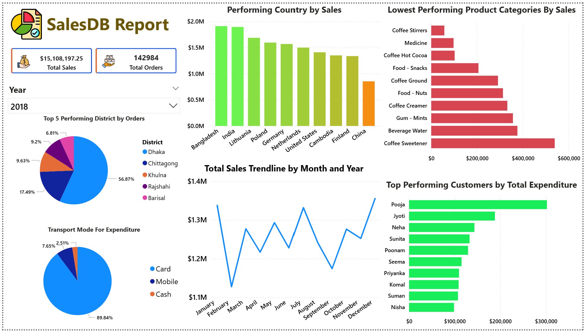

# **Data Analysis using SQL and Power BI**
## Disclaimer - Disclaimer: The dataset used in this analysis is fictional and was obtained from Kaggle for educational purposes only.

## USE of SQL SERVER
In these part, I utilize SQL SERVER for Data preperation, Data cleaning, and data validation. I follow the concept of  Medallion Architure frow raw data to clead data for visualization.
a. Create Database name SalesDB
b. Insert the csv File using BULK Insert command in the bronze schema.
c. Implement Data cleaning such as removing duplicates, fix text format, standardized dates and handles missing values
d. Saved the clean table in the gold schema and create View. 

## Conduct Exploratory Analysis
To see the findings, refer to the document "Exploratory Analysis for SalesDB database.pdf" uploaded in these repository. 
These document use to compare or validate the result in PowerBi graph to make sure the data is correct. 

## USE of POWER BI
In these part, I use Power BI for data visualization. The image below is the Dashboard I created in PowerBI
a. Create a data modeling by connecting the foreign key of the dimension table to fact table.
b. Use appropriate graph to visualize the ideas extracted from data set.

